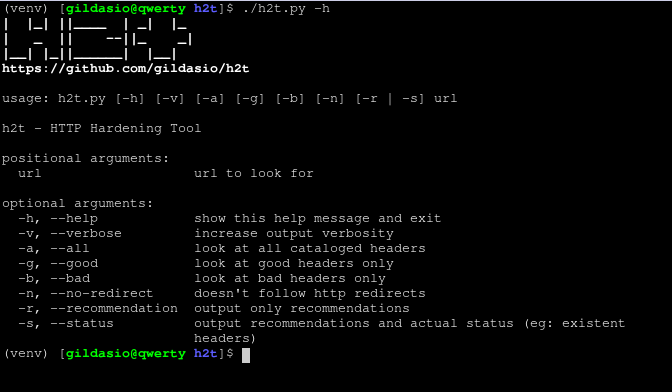

# h2t - HTTP Hardening Tool

## Description

**h2t** is a simple tool to help sysadmins to hardening their websites.

Until now **h2t** checks the website headers and recommends how to make it better.

## Dependences

* [Python 3](https://www.python.org/download/releases/3.0/)
* [colorama](https://github.com/tartley/colorama)
* [requests](http://docs.python-requests.org/en/master/)

## Install

~~~
$ git clone https://github.com/gildasio/h2t
$ cd h2t
$ pip install -r requirements.txt
$ ./h2t.py -h
~~~

## Usage

~~~
$ ./h2t.py -h
      eeee
e   e    8 eeeee
8   8    8   8
8eee8 eee8   8e
88  8 8      88
88  8 8eee   88

https://github.com/gildasio/h2t

usage: h2t.py [-h] [-v] [-a] [-g] [-b] [-n] [-r | -s] url

h2t - HTTP Hardening Tool

positional arguments:
  url                   url to look for

optional arguments:
  -h, --help            show this help message and exit
  -v, --verbose         increase output verbosity
  -a, --all             look at all cataloged headers
  -g, --good            look at good headers only
  -b, --bad             look at bad headers only
  -n, --no-redirect     doesn't follow http redirects
  -r, --recommendation  output only recommendations
  -s, --status          output recommendations and actual status (eg: existent
                        headers)
~~~

### Screenshots

#### Help

#### My website

