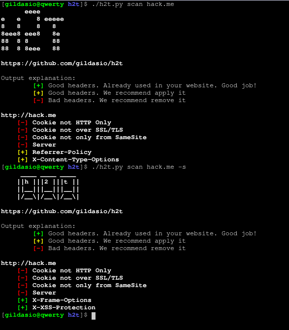
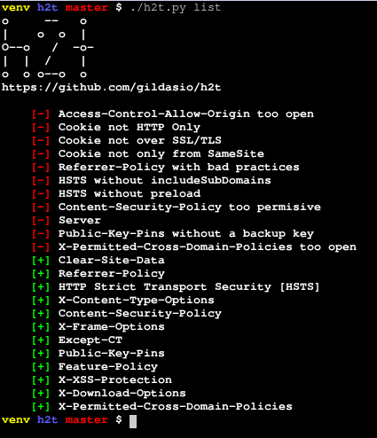
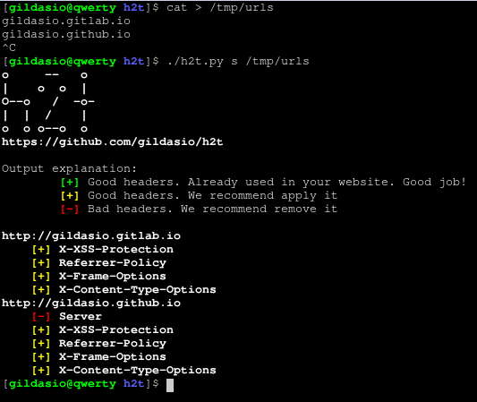
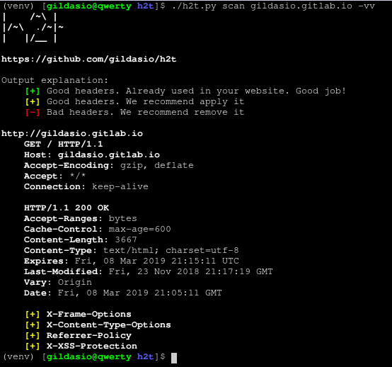
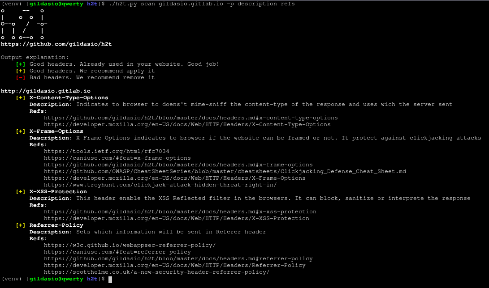

# h2t - HTTP Hardening Tool

## Description

**h2t** is a simple tool to help sysadmins to hardening their websites.

Until now **h2t** checks the website headers and recommends how to make it better.

## Dependences

* [Python 3](https://www.python.org/download/releases/3.0/)
* [colorama](https://github.com/tartley/colorama)
* [requests](http://docs.python-requests.org/en/master/)

## Install

~~~
$ git clone https://github.com/gildasio/h2t
$ cd h2t
$ pip install -r requirements.txt
$ ./h2t.py -h
~~~

... or the Docker way:
~~~
$ git clone https://github.com/gildasio/h2t
$ cd h2t
$ docker build -t h2t .
$ docker run --rm h2t -h
~~~

You also can put `alias h2t='docker run --rm h2t'` on a file (such as `~/.bash_aliases`) and run as follows:

~~~
$ h2t -h
~~~

## Usage

**h2t** has subcommands: *list* and *scan*.

~~~
$ ./h2t.py -h
usage: h2t.py [-h] {list,l,scan,s} ...

h2t - HTTP Hardening Tool

positional arguments:
  {list,l,scan,s}  sub-command help
    list (l)       show a list of available headers in h2t catalog (that can
                   be used in scan subcommand -H option)
    scan (s)       scan url to hardening headers

optional arguments:
  -h, --help       show this help message and exit
~~~

### List Subcommand

The **list** subcommand lists all headers cataloged in **h2t** and can show informations about it as a description, links for more information and for how to's.

~~~
$ ./h2t.py list -h
usage: h2t.py list [-h] [-p PRINT [PRINT ...]] [-B]
                   [-a | -H HEADERS [HEADERS ...]]

optional arguments:
  -h, --help            show this help message and exit
  -p PRINT [PRINT ...], --print PRINT [PRINT ...]
                        a list of additional information about the headers to
                        print. For now there are two options: description and
                        refs (you can use either or both)
  -B, --no-banner       don't print the h2t banner
  -a, --all             list all available headers [default]
  -H HEADERS [HEADERS ...], --headers HEADERS [HEADERS ...]
                        a list of headers to look for in the h2t catalog
~~~

### Scan Subcommand

The **scan** subcommand perform a scan in a website looking for their headers.

~~~
$ ./h2t.py scan -h
usage: h2t.py scan [-h] [-v] [-a] [-g] [-b] [-H HEADERS [HEADERS ...]]
                   [-p PRINT [PRINT ...]]
                   [-i IGNORE_HEADERS [IGNORE_HEADERS ...]] [-B] [-E] [-n]
                   [-u USER_AGENT] [-r | -s]
                   url

positional arguments:
  url                   url to look for

optional arguments:
  -h, --help            show this help message and exit
  -v, --verbose         increase output verbosity: -v print response headers,
                        -vv print response and request headers
  -a, --all             scan all cataloged headers [default]
  -g, --good            scan good headers only
  -b, --bad             scan bad headers only
  -H HEADERS [HEADERS ...], --headers HEADERS [HEADERS ...]
                        scan only these headers (see available in list sub-
                        command)
  -p PRINT [PRINT ...], --print PRINT [PRINT ...]
                        a list of additional information about the headers to
                        print. For now there are two options: description and
                        refs (you can use either or both)
  -i IGNORE_HEADERS [IGNORE_HEADERS ...], --ignore-headers IGNORE_HEADERS [IGNORE_HEADERS ...]
                        a list of headers to ignore in the results
  -B, --no-banner       don't print the h2t banner
  -E, --no-explanation  don't print the h2t output explanation
  -o {normal,csv,json}, --output {normal,csv,json}
                        choose which output format to use (available: normal,
                        csv, json)
  -n, --no-redirect     don't follow http redirects
  -u USER_AGENT, --user-agent USER_AGENT
                        set user agent to scan request
  -k, --insecure        don't verify SSL certificate as valid
  -r, --recommendation  output only recommendations [default]
  -s, --status          output actual status (eg: existent headers only)
~~~

### Output

For now the output is only in normal mode. Understant it as follows:

* [+] Red Headers are bad headers that open a breach on your website or maybe show a lots of information. We recommend fix it.
* [+] Yellow Headers are good headers that is not applied on your website. We recommend apply them.
* [-] Green Headers are good headers that is already used in your website. It's shown when use `-s` flag.

Example:

* Cookie HTTP Only would be good to be applied
* Cookie over SSL/TLS would be good to be applied
* Server header would be good to be removed
* Referrer-Policy would be good to be applied
* X-Frame-Options is already in use, nothing to do here
* X-XSS-Protection is already in use, nothing to do here

### Screenshots

#### List h2t catalog

#### Scan from file

#### Scan url

#### Scan verbose

#### Headers information

## Contribute

For contribute guidelines look at [CONTRIBUTING](CONTRIBUTING.md)
